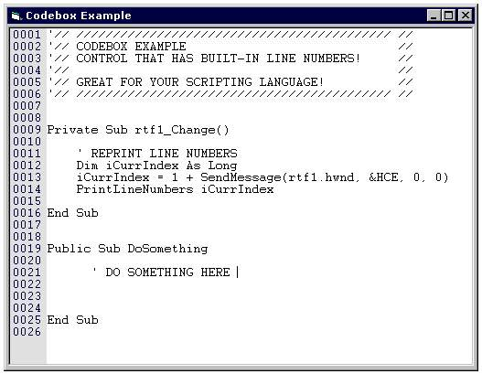



## Codebox with Line Numbers

### Description

This is a rich-text-box with a built-in line-number panel on the left. Typical use would be for a script editor language IDE. I Couldn't find a decent one on here that did this, so I spent some time doing it myself, and passing it on for you to use (and improve on, of course). It is a pretty basic control, but I did make into a control so you can just pop it onto a form and go (of course, source code for control is included). You can control the Line Number panel width, backcolor and forecolor, along with all textbox stuff (uses RTF in case you want to use my syntax code colorizer submission). The Line number panel automatically adjusts its font to be the same name/size/etc., as the text box so that they line up properly. Hope you find it helpful - if so, votes are always appreciated (kind of makes me feel like it was time well spent).
 
### More Info
 

             |
---                |---
**Submitted On**   |2002-05-07 14:10:16
**By**             |[Anthony Dunleavy](https://github.com/Planet-Source-Code/PSCIndex/blob/master/ByAuthor/anthony-dunleavy.md)
**Level**          |Intermediate
**User Rating**    |4.7 (66 globes from 14 users)
**Compatibility**  |VB 5\.0, VB 6\.0
**Category**       |[Custom Controls/ Forms/  Menus](https://github.com/Planet-Source-Code/PSCIndex/blob/master/ByCategory/custom-controls-forms-menus__1-4.md)
**World**          |[Visual Basic](https://github.com/Planet-Source-Code/PSCIndex/blob/master/ByWorld/visual-basic.md)
**Archive File**   |[Codebox\_wi80456572002\.zip](https://github.com/Planet-Source-Code/anthony-dunleavy-codebox-with-line-numbers__1-34531/archive/master.zip)

